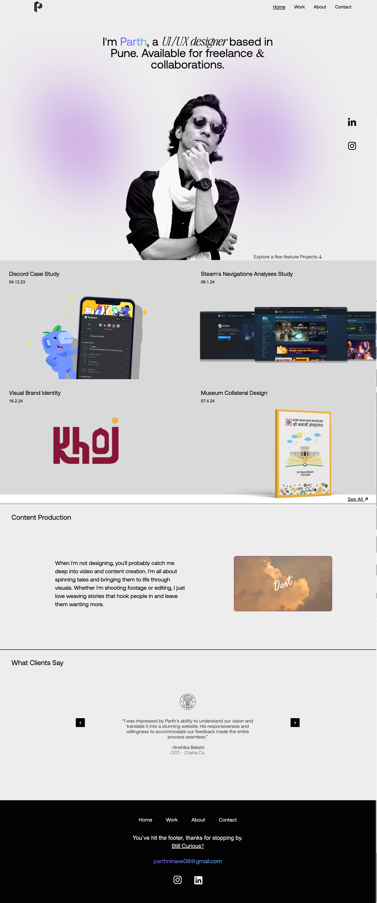
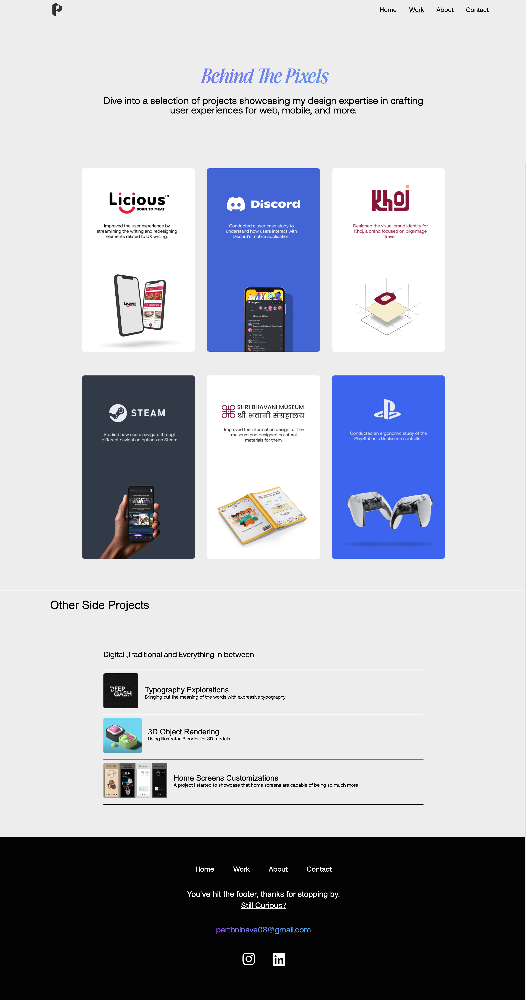

# Portfolio Website

This project involves translating a Figma design, created by my friend, into a functional website using code. The goal is to bring the design to life and create an interactive portfolio website that showcases my work.

## Design Preview

Below are preview images of the home and work pages from the Figma design:

### Home Page

### Work Page

## About

The "About" section of the website provides information about myself, including my background, skills, and experience.

## Work

The "Work" page showcases my projects, work samples, and portfolio pieces. Each project comes with a description highlighting my role, technologies used, and outcomes.

## Contact

The "Contact" page provides various ways to get in touch with me, including a contact form, email address, and social media links.

## Development

This website is being developed using HTML, CSS, and some  JavaScript. It is designed to be interactive .

